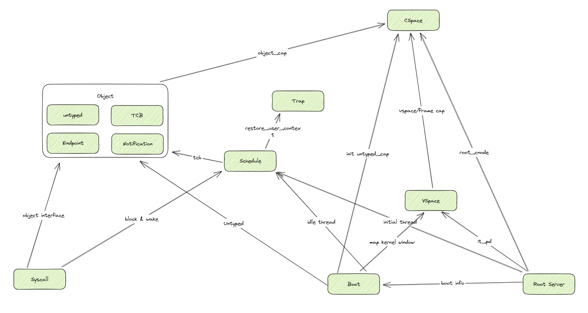

# seL4 模块化分析

#### 模块划分

这里主要对seL4内核进行划分。

* Boot：内核的入口，负责初始化内存和 untyped，填充 `NDKS_BOOT` 这个数据结构。创建 `Idle Thread`。初始化中断向量表。
* Root Server：创建和初始化 `Root Server` 的内核对象，，创建各种子对象对应的cap（CSpace）， 创建 Vspace， 创建和初始化Root Server的虚拟内存映射。初始化 `Root Server` 的 `Initial Thread` 。
* CSpace：提供各种Cap和CNode、TCBCNode的定义以及定义在其上的操作接口。这个是最独立的，不依赖其他任何模块。
* VSpace：首先在 boot 阶段提供对内核地址空间的的VSpace的初始化。其次还提供各种map操作和查找操作。
* Schedule：全局调度的相关数据和对应的调度接口。
* Trap：定义用户态和内核态的切换接口。
* Object：定义各种内核对象，以及在上面可以完成的一些操作接口。
  * untyped
  * TCB
  * endpoint
  * notification
* Syscall：主要用于处理中断、异常和系统调用。这里的依赖比较复杂。几乎依赖了上面提到的所有模块。

<figure><figcaption></figcaption></figure>

#### 独立性分析

从图中看出，独立性最强的是 `CSpace` 模块。可以做到完全不依赖其他模块，其他模块会更多的依赖它。它提供了各种内核对象的句柄的定义和操作，以及提供了句柄派生等操作接口。

其次是 Object 模块，定义了各种内核对象及可以在上面进行的操作。它是十分依赖于 `CSpace` 模块的。

这两个模块都可以用Rust重写，以静态库的形式提供给 seL4。但是这里有两个问题：

* 原始的seL4 kernel 的编译是将所有的代码拷贝到一个文件下进行编译，模块化之后对代码的架构和构建会有很大的调整。
* 上述的模块划分更多的是功能性模块而非过程性模块，基本无法对某个单独的模块实施异步化。

### 从代码层面的分析

seL4 内核从编译构建的角度来讲，一共有三个组成部分：

* head.S：负责内核启动的少量汇编代码。
* trap.S：负责陷入和中断时保存上下文的少量汇编代码。
* kernel\_all.c：内核代码。

三个部分分别编译，然后链接到一起组成kernel.elf文件。分别是以下四组命令：

```bash
/usr/bin/ccache /opt/riscv/bin/riscv64-unknown-linux-gnu-gcc --sysroot=/home/ctrlz/workSpace/seL4test/build  -I/home/ctrlz/workSpace/seL4test/kernel/include/plat/default -I/home/ctrlz/workSpace/seL4test/kernel/include -I/home/ctrlz/workSpace/seL4test/kernel/include/64 -I/home/ctrlz/workSpace/seL4test/kernel/include/arch/riscv -I/home/ctrlz/workSpace/seL4test/kernel/include/arch/riscv/arch/64 -I/home/ctrlz/workSpace/seL4test/kernel/include/plat/spike -I/home/ctrlz/workSpace/seL4test/kernel/include/plat/spike/plat/64 -I/home/ctrlz/workSpace/seL4test/kernel/libsel4/include -I/home/ctrlz/workSpace/seL4test/kernel/libsel4/arch_include/riscv -I/home/ctrlz/workSpace/seL4test/kernel/libsel4/sel4_arch_include/riscv64 -I/home/ctrlz/workSpace/seL4test/kernel/libsel4/sel4_plat_include/spike -I/home/ctrlz/workSpace/seL4test/kernel/libsel4/mode_include/64 -I/home/ctrlz/workSpace/seL4test/build/kernel/gen_config -I/home/ctrlz/workSpace/seL4test/build/kernel/autoconf -I/home/ctrlz/workSpace/seL4test/build/kernel/gen_headers -I/home/ctrlz/workSpace/seL4test/build/kernel/generated -D__KERNEL_64__ -march=rv64imac_zicsr_zifencei -mabi=lp64 -O2 -g -DNDEBUG -std=c99 -Wall -Werror -Wstrict-prototypes -Wmissing-prototypes -Wnested-externs -Wmissing-declarations -Wundef -Wpointer-arith -Wno-nonnull -nostdinc -ffreestanding -fno-stack-protector -fno-asynchronous-unwind-tables -fno-common -O2 -nostdlib -fno-pic -fno-pie -DDEBUG -g -ggdb -mcmodel=medany -msmall-data-limit=1024 -MD -MT kernel/CMakeFiles/kernel.elf.dir/src/arch/riscv/head.S.obj -MF kernel/CMakeFiles/kernel.elf.dir/src/arch/riscv/head.S.obj.d -o kernel/CMakeFiles/kernel.elf.dir/src/arch/riscv/head.S.obj -c /home/ctrlz/workSpace/seL4test/kernel/src/arch/riscv/head.S

/usr/bin/ccache /opt/riscv/bin/riscv64-unknown-linux-gnu-gcc --sysroot=/home/ctrlz/workSpace/seL4test/build  -I/home/ctrlz/workSpace/seL4test/kernel/include/plat/default -I/home/ctrlz/workSpace/seL4test/kernel/include -I/home/ctrlz/workSpace/seL4test/kernel/include/64 -I/home/ctrlz/workSpace/seL4test/kernel/include/arch/riscv -I/home/ctrlz/workSpace/seL4test/kernel/include/arch/riscv/arch/64 -I/home/ctrlz/workSpace/seL4test/kernel/include/plat/spike -I/home/ctrlz/workSpace/seL4test/kernel/include/plat/spike/plat/64 -I/home/ctrlz/workSpace/seL4test/kernel/libsel4/include -I/home/ctrlz/workSpace/seL4test/kernel/libsel4/arch_include/riscv -I/home/ctrlz/workSpace/seL4test/kernel/libsel4/sel4_arch_include/riscv64 -I/home/ctrlz/workSpace/seL4test/kernel/libsel4/sel4_plat_include/spike -I/home/ctrlz/workSpace/seL4test/kernel/libsel4/mode_include/64 -I/home/ctrlz/workSpace/seL4test/build/kernel/gen_config -I/home/ctrlz/workSpace/seL4test/build/kernel/autoconf -I/home/ctrlz/workSpace/seL4test/build/kernel/gen_headers -I/home/ctrlz/workSpace/seL4test/build/kernel/generated -D__KERNEL_64__ -march=rv64imac_zicsr_zifencei -mabi=lp64 -O2 -g -DNDEBUG -std=c99 -Wall -Werror -Wstrict-prototypes -Wmissing-prototypes -Wnested-externs -Wmissing-declarations -Wundef -Wpointer-arith -Wno-nonnull -nostdinc -ffreestanding -fno-stack-protector -fno-asynchronous-unwind-tables -fno-common -O2 -nostdlib -fno-pic -fno-pie -DDEBUG -g -ggdb -mcmodel=medany -msmall-data-limit=1024 -MD -MT kernel/CMakeFiles/kernel.elf.dir/src/arch/riscv/traps.S.obj -MF kernel/CMakeFiles/kernel.elf.dir/src/arch/riscv/traps.S.obj.d -o kernel/CMakeFiles/kernel.elf.dir/src/arch/riscv/traps.S.obj -c /home/ctrlz/workSpace/seL4test/kernel/src/arch/riscv/traps.S

/usr/bin/ccache /opt/riscv/bin/riscv64-unknown-linux-gnu-gcc --sysroot=/home/ctrlz/workSpace/seL4test/build  -I/home/ctrlz/workSpace/seL4test/kernel/include/plat/default -I/home/ctrlz/workSpace/seL4test/kernel/include -I/home/ctrlz/workSpace/seL4test/kernel/include/64 -I/home/ctrlz/workSpace/seL4test/kernel/include/arch/riscv -I/home/ctrlz/workSpace/seL4test/kernel/include/arch/riscv/arch/64 -I/home/ctrlz/workSpace/seL4test/kernel/include/plat/spike -I/home/ctrlz/workSpace/seL4test/kernel/include/plat/spike/plat/64 -I/home/ctrlz/workSpace/seL4test/kernel/libsel4/include -I/home/ctrlz/workSpace/seL4test/kernel/libsel4/arch_include/riscv -I/home/ctrlz/workSpace/seL4test/kernel/libsel4/sel4_arch_include/riscv64 -I/home/ctrlz/workSpace/seL4test/kernel/libsel4/sel4_plat_include/spike -I/home/ctrlz/workSpace/seL4test/kernel/libsel4/mode_include/64 -I/home/ctrlz/workSpace/seL4test/build/kernel/gen_config -I/home/ctrlz/workSpace/seL4test/build/kernel/autoconf -I/home/ctrlz/workSpace/seL4test/build/kernel/gen_headers -I/home/ctrlz/workSpace/seL4test/build/kernel/generated -D__KERNEL_64__ -march=rv64imac_zicsr_zifencei -mabi=lp64 -O2 -g -DNDEBUG -std=c99 -Wall -Werror -Wstrict-prototypes -Wmissing-prototypes -Wnested-externs -Wmissing-declarations -Wundef -Wpointer-arith -Wno-nonnull -nostdinc -ffreestanding -fno-stack-protector -fno-asynchronous-unwind-tables -fno-common -O2 -nostdlib -fno-pic -fno-pie -DDEBUG -g -ggdb -mcmodel=medany -msmall-data-limit=1024 -MD -MT kernel/CMakeFiles/kernel.elf.dir/kernel_all.c.obj -MF kernel/CMakeFiles/kernel.elf.dir/kernel_all.c.obj.d -o kernel/CMakeFiles/kernel.elf.dir/kernel_all.c.obj -c /home/ctrlz/workSpace/seL4test/build/kernel/kernel_all.c

/usr/bin/ccache /opt/riscv/bin/riscv64-unknown-linux-gnu-gcc --sysroot=/home/ctrlz/workSpace/seL4test/build -D__KERNEL_64__ -march=rv64imac_zicsr_zifencei -mabi=lp64 -O2 -g -DNDEBUG -D__KERNEL_64__ -march=rv64imac_zicsr_zifencei -mabi=lp64   -static -Wl,--build-id=none -Wl,-n -O2  -nostdlib  -fno-pic  -fno-pie  -DDEBUG  -g  -ggdb  -mcmodel=medany  -msmall-data-limit=1024     -Wl,-T /home/ctrlz/workSpace/seL4test/build/kernel/linker.lds_pp kernel/CMakeFiles/kernel.elf.dir/src/arch/riscv/head.S.obj kernel/CMakeFiles/kernel.elf.dir/src/arch/riscv/traps.S.obj kernel/CMakeFiles/kernel.elf.dir/kernel_all.c.obj -o kernel/kernel.elf
```

而对于主体的kernel\_all.c代码，是由几十个c文件合并而成的，在构建过程中体现的命令为：

```bash
cd /home/ctrlz/workSpace/seL4test/build/kernel && /home/ctrlz/workSpace/seL4test/kernel/tools/cpp_gen.sh /home/ctrlz/workSpace/seL4test/kernel/src/api/faults.c /home/ctrlz/workSpace/seL4test/kernel/src/api/syscall.c /home/ctrlz/workSpace/seL4test/kernel/src/arch/riscv/api/benchmark.c /home/ctrlz/workSpace/seL4test/kernel/src/arch/riscv/api/faults.c /home/ctrlz/workSpace/seL4test/kernel/src/arch/riscv/c_traps.c /home/ctrlz/workSpace/seL4test/kernel/src/arch/riscv/idle.c /home/ctrlz/workSpace/seL4test/kernel/src/arch/riscv/kernel/boot.c /home/ctrlz/workSpace/seL4test/kernel/src/arch/riscv/kernel/thread.c /home/ctrlz/workSpace/seL4test/kernel/src/arch/riscv/kernel/vspace.c /home/ctrlz/workSpace/seL4test/kernel/src/arch/riscv/machine/capdl.c /home/ctrlz/workSpace/seL4test/kernel/src/arch/riscv/machine/fpu.c /home/ctrlz/workSpace/seL4test/kernel/src/arch/riscv/machine/hardware.c /home/ctrlz/workSpace/seL4test/kernel/src/arch/riscv/machine/io.c /home/ctrlz/workSpace/seL4test/kernel/src/arch/riscv/machine/registerset.c /home/ctrlz/workSpace/seL4test/kernel/src/arch/riscv/model/statedata.c /home/ctrlz/workSpace/seL4test/kernel/src/arch/riscv/object/interrupt.c /home/ctrlz/workSpace/seL4test/kernel/src/arch/riscv/object/objecttype.c /home/ctrlz/workSpace/seL4test/kernel/src/arch/riscv/object/tcb.c /home/ctrlz/workSpace/seL4test/kernel/src/arch/riscv/smp/ipi.c /home/ctrlz/workSpace/seL4test/kernel/src/assert.c /home/ctrlz/workSpace/seL4test/kernel/src/benchmark/benchmark.c /home/ctrlz/workSpace/seL4test/kernel/src/benchmark/benchmark_track.c /home/ctrlz/workSpace/seL4test/kernel/src/benchmark/benchmark_utilisation.c /home/ctrlz/workSpace/seL4test/kernel/src/fastpath/fastpath.c /home/ctrlz/workSpace/seL4test/kernel/src/inlines.c /home/ctrlz/workSpace/seL4test/kernel/src/kernel/boot.c /home/ctrlz/workSpace/seL4test/kernel/src/kernel/cspace.c /home/ctrlz/workSpace/seL4test/kernel/src/kernel/faulthandler.c /home/ctrlz/workSpace/seL4test/kernel/src/kernel/stack.c /home/ctrlz/workSpace/seL4test/kernel/src/kernel/thread.c /home/ctrlz/workSpace/seL4test/kernel/src/machine/capdl.c /home/ctrlz/workSpace/seL4test/kernel/src/machine/fpu.c /home/ctrlz/workSpace/seL4test/kernel/src/machine/io.c /home/ctrlz/workSpace/seL4test/kernel/src/machine/registerset.c /home/ctrlz/workSpace/seL4test/kernel/src/model/preemption.c /home/ctrlz/workSpace/seL4test/kernel/src/model/smp.c /home/ctrlz/workSpace/seL4test/kernel/src/model/statedata.c /home/ctrlz/workSpace/seL4test/kernel/src/object/cnode.c /home/ctrlz/workSpace/seL4test/kernel/src/object/endpoint.c /home/ctrlz/workSpace/seL4test/kernel/src/object/interrupt.c /home/ctrlz/workSpace/seL4test/kernel/src/object/notification.c /home/ctrlz/workSpace/seL4test/kernel/src/object/objecttype.c /home/ctrlz/workSpace/seL4test/kernel/src/object/tcb.c /home/ctrlz/workSpace/seL4test/kernel/src/object/untyped.c /home/ctrlz/workSpace/seL4test/kernel/src/smp/ipi.c /home/ctrlz/workSpace/seL4test/kernel/src/smp/lock.c /home/ctrlz/workSpace/seL4test/kernel/src/string.c /home/ctrlz/workSpace/seL4test/kernel/src/util.c /home/ctrlz/workSpace/seL4test/projects/sel4test/domain_schedule.c > kernel_all.c
```

从kernel\_all.c代码中来看，一共包含了49个c文件的全部代码。从这里可以看出，维护人员大约是想将内核分为这么49个小模块进行维护。

如果我们要用Rust重写某一模块，那么我们可以只在对应的C文件中放入接口声明，然后在Rust编译出的静态库中提供实现，最后将Rust静态库和上面提到的三个Obj文件一起链接即可。


但现在的问题是，这49个文件中包含的头文件依赖十分复杂，特别是对于某些结构体的定义，比如我们所认为比较独立的跟Capbility相关的操作大都包含在了structure\_gen.h文件中，以静态内联的形式提供给各个c文件。再比如cnode.c文件中包含了在cnode上可以进行的各个操作，但他也使用了其他模块的函数如：syscall.c模块的getSyscallArg接口，objecttype.c的deriveCap接口，thread.c的setThreadState接口等等。

这些模块的依赖关系并不是简单的树形结构，而是较为复杂的图形结构。因此如果要用Rust重写某一模块的话，该静态库不仅需要提供c接口的Rust实现，还需要依赖一些c提供的接口。


### Rust重写idle文件并链接到kernel.elf

下面以kernel中的idle.c文件为例，思考一下如何用Rust逐步重写sel4 kernel.

idle.c十分简单，依赖也相对较少：

```c
void idle_thread(void)
{
    while (1) {
        asm volatile("wfi");
    }
}

/** DONT_TRANSLATE */
void VISIBLE NO_INLINE halt(void)
{
#ifdef CONFIG_PRINTING
    printf("halting...");
#ifdef CONFIG_DEBUG_BUILD
    debug_printKernelEntryReason();
#endif /* CONFIG_DEBUG_BUILD */
#endif /* CONFIG_PRINTING */

    sbi_shutdown();

    UNREACHABLE();
}
```

首先我们需要确定，用Rust重写这个文件，对外我们需要提供两个接口：

* idle\_thread
* halt

对内我们需要外部的一个函数接口：sbi\_shutdown。

我们新建一个rust lib crate，target与seL4的c编译环境保持一致为：

````toml
```
# idle/.cargo/config.toml
[build]
target = "riscv64imac-unknown-none-elf"
```
````

Rust的FFI和Link教程参考：

* [https://rustwiki.org/zh-CN/reference/linkage.html](https://rustwiki.org/zh-CN/reference/linkage.html)
* [https://doc.rust-lang.org/nomicon/ffi.html](https://doc.rust-lang.org/nomicon/ffi.html)

这里直接放上lib.rs：

````rust
```rust
#![no_std]
#![crate_type = "staticlib"]

use core::arch::asm;

mod lang_item;

#[link(name = "kernel_all.c")]
extern {
    fn sbi_shutdown();
}


#[no_mangle]
pub extern "C" fn idle_thread() {
    while true {
        unsafe {
            asm!("wfi");
        }
    }
}

#[no_mangle]
pub extern "C" fn halt() {
    unsafe {
        sbi_shutdown()
    }
}
```
````

然后编译生成静态库文件：

```bash
cargo build --release
```

然后我们处理一下kernel\_all.c文件，将两个函数的实现定义为外部函数声明：

```c
#line 1 "/home/ctrlz/workSpace/seL4/seL4test/kernel/src/arch/riscv/idle.c"
/*
 * Copyright 2020, Data61, CSIRO (ABN 41 687 119 230)
 * Copyright 2015, 2016 Hesham Almatary <heshamelmatary@gmail.com>
 *
 * SPDX-License-Identifier: GPL-2.0-only
 */

#include <config.h>
#include <arch/sbi.h>

extern void idle_thread(void);


/** DONT_TRANSLATE */
extern void VISIBLE NO_INLINE halt(void);
```

重新编译kernel\_all.c.obj：

```bash
/usr/bin/ccache /home/ctrlz/software/riscv64-unknown-toolchain/bin/riscv64-unknown-elf-gcc --sysroot=/home/ctrlz/workSpace/seL4/seL4test/build  -I/home/ctrlz/workSpace/seL4/seL4test/kernel/include/plat/default -I/home/ctrlz/workSpace/seL4/seL4test/kernel/include -I/home/ctrlz/workSpace/seL4/seL4test/kernel/include/64 -I/home/ctrlz/workSpace/seL4/seL4test/kernel/include/arch/riscv -I/home/ctrlz/workSpace/seL4/seL4test/kernel/include/arch/riscv/arch/64 -I/home/ctrlz/workSpace/seL4/seL4test/kernel/include/plat/spike -I/home/ctrlz/workSpace/seL4/seL4test/kernel/include/plat/spike/plat/64 -I/home/ctrlz/workSpace/seL4/seL4test/kernel/libsel4/include -I/home/ctrlz/workSpace/seL4/seL4test/kernel/libsel4/arch_include/riscv -I/home/ctrlz/workSpace/seL4/seL4test/kernel/libsel4/sel4_arch_include/riscv64 -I/home/ctrlz/workSpace/seL4/seL4test/kernel/libsel4/sel4_plat_include/spike -I/home/ctrlz/workSpace/seL4/seL4test/kernel/libsel4/mode_include/64 -I/home/ctrlz/workSpace/seL4/seL4test/build/kernel/gen_config -I/home/ctrlz/workSpace/seL4/seL4test/build/kernel/autoconf -I/home/ctrlz/workSpace/seL4/seL4test/build/kernel/gen_headers -I/home/ctrlz/workSpace/seL4/seL4test/build/kernel/generated -D__KERNEL_64__ -march=rv64imac -mabi=lp64 -O3 -DNDEBUG -std=c99 -Wall -Wstrict-prototypes -Wmissing-prototypes -Wnested-externs -Wmissing-declarations -Wundef -Wpointer-arith -Wno-nonnull -nostdinc -ffreestanding -fno-stack-protector -fno-asynchronous-unwind-tables -fno-common -O2 -nostdlib -fno-pic -fno-pie -mcmodel=medany -msmall-data-limit=1024 -MD -MT kernel/CMakeFiles/kernel.elf.dir/kernel_all.c.obj -MF kernel/CMakeFiles/kernel.elf.dir/kernel_all.c.obj.d -o kernel/CMakeFiles/kernel.elf.dir/kernel_all.c.obj -c /home/ctrlz/workSpace/seL4/seL4test/build/kernel/kernel_all.c
```

然后重新链接kernel.elf，前半部分和之前的链接命令相同，只不过需要添加新的链接库：

```bash
/usr/bin/ccache /home/ctrlz/software/riscv64-unknown-toolchain/bin/riscv64-unknown-elf-gcc .......  -L"your_lib_path" -lidle -o kernel/kernel.elf
```

链接成功之后旧的kernel.elf文件就被覆盖，然后直接启动simulate进行测试：


测试通过，Rust重写idle.c文件完成！
